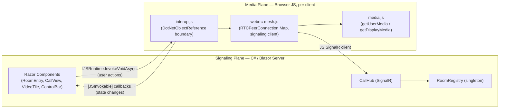

# Architecture Spine — FlowBoard Video Calls

## Design Paradigm

**Signaling-Plane / Media-Plane Separation.** The system has two planes that never share objects, only opaque messages:

- **Signaling plane** (C# / Blazor Server / SignalR `CallHub`) — owns room membership and relays SDP/ICE payloads between specific peers. Treats every payload as an opaque string; never inspects or holds a WebRTC object.
- **Media plane** (JavaScript, browser-only) — owns every `RTCPeerConnection`, every `MediaStream`, `getUserMedia`/`getDisplayMedia`, and all `<video>` rendering. Talks to the signaling plane directly via its own SignalR JS client connection.

C# and JS meet only at a thin callback boundary: C# tells JS about user actions (mute, camera toggle, share, hang up, permission-retry); JS tells C# about state changes worth rendering — the full, named set is in **Signaling & Interop Contract** below. Neither side reaches into the other's owned objects.



Dependency direction: `Components` may call into `Interop` (never into `Mesh`/`Media` directly); `Mesh`/`Media` never call C# except through the registered `Interop` callback object. `Hub` depends only on `Registry`; `Registry` depends on nothing else in the system.

## Invariants & Rules

### AD-1 — Signaling/media plane objects never cross the interop boundary

- **Binds:** all
- **Prevents:** C# reaching into WebRTC internals (inspecting/mutating a `MediaStream` or `RTCPeerConnection` from Blazor), or JS holding product state (participant roster, mute UI state) as its own source of truth.
- **Rule:** `RTCPeerConnection` and `MediaStream` objects exist and are mutated exclusively in JS. Only opaque signaling payloads (SDP strings, ICE candidate JSON) and primitive state (connectionId, bool flags) cross the JS↔C# interop boundary. Blazor UI state is populated only via `[JSInvokable]` callback events, never read by C# from a JS object directly.

### AD-2 — Deterministic offerer rule: the joiner always offers

- **Binds:** WebRTC mesh orchestration, `CallHub.JoinRoom`
- **Prevents:** glare (both peers simultaneously creating offers to each other) and duplicate/conflicting peer connections for one pair.
- **Rule:** The newly joining participant is always the SDP offerer to every participant already in the room; existing participants are always the answerer to a newcomer's offer. No participant ever offers to a peer it already holds a connection to (in either direction). This rule is made safe against concurrent joins by AD-4's atomic `AddAndSnapshot` (below) — the join-time snapshot two participants see can never both be "the other isn't here yet." As defense-in-depth against a future bug in that atomicity, the fallback tie-break is: if a peer ever receives an offer for a connectionId it also just sent an offer to, the participant with the lexicographically **greater** `connectionId` (ordinal string compare) keeps its offer and the other discards its own outbound offer and answers instead.

### AD-3 — CallHub is an opaque relay

- **Binds:** `CallHub`
- **Prevents:** server-side coupling to WebRTC/SDP protocol details, and future "smart" signaling logic creeping into the hub.
- **Rule:** `SendOffer` / `SendAnswer` / `SendIceCandidate` forward their payload verbatim to `Clients.Client(targetConnectionId)` — never `Clients.Group` / `Clients.Others` — and never parse or inspect the SDP/ICE content.

### AD-4 — RoomRegistry is the single source of truth for membership, mutated only through atomic compound operations

- **Binds:** `RoomRegistry`, `CallHub`
- **Prevents:** a second, drifting notion of "who is in this room"; a two-dictionary write-ordering race that orphans a participant record; and the join-time race where two simultaneous joiners each snapshot the other as "not here yet" (the precondition AD-2 depends on).
- **Rule:** `RoomRegistry` holds exactly **one** `ConcurrentDictionary<string connectionId, ParticipantRecord>`, where `ParticipantRecord` carries `RoomId` and `ParticipantInfo` together — there is no separate reverse-lookup dictionary, so there is no second writer to fall out of sync with the first. `GetParticipants(roomId)` is a filtered read over this single dictionary. The two operations that must observe-and-mutate atomically are exposed as single indivisible methods, each implemented with one `lock` around the whole compound step (a single coarse lock across the registry, not per-room fine-grained locking — deliberate: room sizes and join/leave frequency at this project's scale don't justify the added complexity; Rule of Three applies if that ever changes):
  - `AddAndSnapshot(connectionId, roomId, info) -> IReadOnlyList<ParticipantRecord>` — adds the caller and returns the existing-participants snapshot as one atomic step. `CallHub.JoinRoom` calls this exactly once and never calls `Add` and a separate `GetParticipants` as two steps.
  - `RemoveAndGetRemaining(connectionId) -> (roomId, IReadOnlyList<ParticipantRecord> remaining)` — removes the caller and returns who's left, atomically. `CallHub.OnDisconnectedAsync` is the sole caller and the sole teardown path (there is no separate `LeaveRoom` method — a client-initiated hang-up closes its hub connection, which triggers this same path).
  - `SetSharingState(connectionId, isSharing) -> (roomId, IReadOnlyList<ParticipantRecord> peers)` — used by the screen-share start/stop flow (AD-7); same atomicity discipline.
- **Refresh/reload:** a browser refresh opens a brand-new hub connection (a new `connectionId`) before the old one's disconnect is transport-detected, which can otherwise leave a "ghost" tile visible for up to SignalR's default disconnect-detection window. `interop.js` registers a `pagehide` listener that synchronously requests the hub connection be stopped before navigation, so the common refresh/close case reaches `OnDisconnectedAsync` promptly rather than waiting on passive timeout detection. A hard crash/network loss still falls back to passive timeout detection — accepted, since PRD §5 already makes automatic reconnection a non-goal and this is the same class of gap, not a new one.
- **Terminal disconnect, no reconnection:** whether via `pagehide` or passive timeout, a disconnect is terminal for that `connectionId` — `RoomRegistry` never attempts to preserve or restore state for it. Rejoining after any disconnect is only possible via a fresh `RoomEntry` submission, producing a brand-new `connectionId` with no memory of the old one (this is the addendum's "reconnection-on-hub-disconnect" decision, made explicit here).
- **Room-emptiness deletion** `[ASSUMPTION]`: when `RemoveAndGetRemaining` leaves a room's participant count at zero, `RoomRegistry` drops all trace of that `roomId` (there's nothing left to hold — with a single dictionary keyed by `connectionId`, an empty room is simply the absence of any record with that `RoomId`, not a separate cleanup step). No lock spans across a "room delete" and a subsequent "room create," because there is no room-level structure to delete or create — `roomId` is just a field value. This eliminates the entire class of race the earlier two-dictionary design was exposed to.

### AD-5 — No participant cap, anywhere

- **Binds:** `CallHub.JoinRoom`, `RoomRegistry`
- **Prevents:** a `MaxParticipants` config value or size check creeping into `JoinRoom` or `RoomRegistry` during implementation.
- **Rule:** No code path in `JoinRoom` or `RoomRegistry` checks or rejects based on room size (PRD FR-9). Any capacity concern is a client-side rendering/performance matter, never a join-time rejection.

### AD-6 — One local media stream, fanned out

- **Binds:** JS media layer (`media.js`)
- **Prevents:** redundant `getUserMedia()` calls per peer connection, which would produce independent camera/mic streams and desynchronize mute state across connections.
- **Rule:** `getUserMedia()` is called exactly once per Call View session, producing one local `MediaStream` whose tracks are added via `addTrack(track, cameraStream)` to every `RTCPeerConnection` created in that session — always attached to the same `cameraStream` object (see AD-7 for why the stream identity matters). Mute/camera-off toggles set `track.enabled = false` on the shared tracks, never per-connection.

### AD-7 — Screen share is additive, never a camera replacement, and is identified by stream — not by arrival order

- **Binds:** JS media layer, screen-share orchestration, `CallHub`
- **Prevents:** using `replaceTrack()` to swap camera for screen (breaking the UX requirement that camera thumbnails stay visible during a share); the receiving side having no rule for telling a camera track from a screen track; and a newly-created connection silently missing an already-active screen share.
- **Rule:**
  - **Sending side:** `getDisplayMedia()`'s video track is added via `addTrack(track, screenStream)` — a distinct `MediaStream` object from the `cameraStream` (AD-6) — as a second video track on every existing `RTCPeerConnection`, never via `replaceTrack()` against the camera track.
  - **Receiving side (track disambiguation):** the receiving peer's `ontrack` handler routes by `event.streams[0].id`. Because every `RTCPeerConnection` always has its `cameraStream`'s tracks added first — at connection-creation time, before any screen share can exist for a not-yet-created connection (see Track-completeness corollary below) — the **first distinct stream id observed for a given connectionId is always the camera stream**; any later, second distinct stream id for that same connectionId is the screen stream. This requires no additional signaling metadata.
  - **Disconnect ends an active share:** if the active sharer's connection is torn down (AD-4's `RemoveAndGetRemaining`), `CallHub` includes the prior sharing state in that removal and broadcasts `ScreenShareStateChanged(null)` to the remaining participants — a disconnect mid-share is treated identically to that participant clicking Stop (PRD FR-14). This uses the same `SetSharingState`-driven broadcast as an explicit stop, not a separate code path.
  - **Single-active-sharer race** `[ASSUMPTION]`: enforcement is UI-only (Share Screen control disabled for others once `ScreenShareStateChanged` names an active sharer) — `CallHub` has no track visibility to enforce it server-side (AD-1), and PRD FR-12 itself accepted "block, not replace" as a simplicity trade-off. Two participants clicking Share within the same round-trip, before either has received the other's `ScreenShareStateChanged`, can both start sharing simultaneously; this is an accepted v1 race, not resolved at the architecture level.

### AD-8 — Per-pair connection lifecycle is fully independent, and every removal closes before it deletes

- **Binds:** JS WebRTC orchestration (`webrtc-mesh.js`)
- **Prevents:** one failed or closed peer connection cascading into teardown or renegotiation of unrelated connections; and a `RTCPeerConnection` being dereferenced from the tracking Map without being closed, leaking a live transport/media session.
- **Rule:** Every `RTCPeerConnection` is tracked in `Map<connectionId, RTCPeerConnection>`. Every lifecycle operation (create, close, ICE-failure handling, renegotiation) acts on exactly one Map entry; no operation iterates or mutates other entries as a side effect. On every removal path (participant left, connection failed and abandoned, hang-up), `pc.close()` and Map-entry deletion happen together as one mandatory, non-optional pair — a Map entry is never deleted without first closing its connection, and a connection is never closed without also removing its Map entry. This is the structural guarantee behind PRD FR-8 (dynamic join/leave without disruption) and FR-10 (per-pair failure isolation).

### Renegotiation corollary (of AD-2 and AD-7)

For any mid-call track change (screen share start/stop), the participant whose track set changed is always the renegotiation offerer on every affected `RTCPeerConnection`; the counterpart always answers. This keeps "the state-changer offers" consistent for both initial connection (AD-2: joiner is the state-changer) and mid-call changes (AD-7: sharer is the state-changer).

### Track-completeness corollary (of AD-2, AD-6, AD-7)

`createPeerConnection()` always adds **every currently-active local track** at creation time — the AD-6 `cameraStream` tracks *and*, if a screen share is currently active, the AD-7 `screenStream` track — never just "the camera stream." This closes the seam where a participant joining mid-share (via AD-2, as offerer) would otherwise only exchange camera tracks with an existing sharer and never see their screen until the sharer happened to stop and restart. It also underwrites AD-7's receiving-side disambiguation rule: a connection's camera stream is guaranteed present from creation, so any stream arriving afterward is unambiguously the screen stream.

## Consistency Conventions

| Concern | Convention |
| --- | --- |
| Naming (entities, files, interfaces, events) | C#: PascalCase; Hub methods and JS-invokable C# callbacks are verbs (`JoinRoom`, `SendOffer`) / `On`-prefixed events (`OnParticipantJoined`). JS: camelCase; peer-connection lifecycle functions read as verbs on the mesh (`connectToPeer`, `closePeer`). |
| Data & formats (ids, dates, error shapes, envelopes) | SignalR's own `Context.ConnectionId` is the canonical peer identifier end-to-end — never re-keyed to a custom GUID; the same string is the JS `Map` key, the `RoomRegistry` dictionary key, and every DTO's identifier field. SDP and ICE candidates cross the wire as JSON-serialized strings matching the browser's native `RTCSessionDescriptionInit` / `RTCIceCandidateInit` shapes, unmodified by either side. |
| State & cross-cutting (mutation, errors, logging, config, auth) | STUN/ICE server config lives in `appsettings.json` under `WebRtc`, bound via `IOptions<WebRtcOptions>`; never hardcoded in a `.cs` or `.js` file — C# passes it to JS as a parameter of the `initializeCall()` interop call. **Secure context:** the app must be served over `https://` for any non-`localhost` origin — `getUserMedia`/`getDisplayMedia` fail outright without it (browser platform requirement, not a FlowBoard choice); the localhost v1 target is exempt, but this becomes a hard blocker the moment any other origin (e.g. an Azure deployment) is reached. No authentication/authorization layer exists (PRD §5 Non-Goal) — any connectionId reaching a hub method is trusted for its own room's operations. Target browsers: current stable desktop Chrome, Edge, Firefox only (PRD §7) — no polyfills, no mobile-specific handling. |

## Stack

| Name | Version |
| --- | --- |
| .NET / ASP.NET Core (Blazor Server) | 10 (LTS, GA 2025-11-11, supported to 2028-11-14) `[ADOPTED]` |
| SignalR (server, part of ASP.NET Core) | 10.x (ships with ASP.NET Core 10) |
| @microsoft/signalr (JS client) | ^10.0.0 |
| STUN | Google public STUN, `stun:stun.l.google.com:19302` `[ADOPTED — free, no-SLA third-party service; no evidence of deprecation, but verify reachability at deploy time. Risk is already accepted by PRD FR-10/AD-8's per-pair failure isolation.]` |

## Signaling & Interop Contract

The complete named message/callback set — every JS↔C# and C#↔Hub boundary crossing is one of these, nothing else:

**`CallHub` server methods** (JS SignalR client → Hub):

| Method | Signature | Notes |
| --- | --- | --- |
| `JoinRoom` | `Task<IReadOnlyList<ParticipantDto>> JoinRoom(string roomId, string displayName)` | Calls `RoomRegistry.AddAndSnapshot`; returns existing participants (AD-4). |
| `SendOffer` | `Task SendOffer(string targetConnectionId, string sdp)` | Opaque relay (AD-3). |
| `SendAnswer` | `Task SendAnswer(string targetConnectionId, string sdp)` | Opaque relay (AD-3). |
| `SendIceCandidate` | `Task SendIceCandidate(string targetConnectionId, string candidateJson)` | Opaque relay (AD-3). |
| `SetMuteState` | `Task SetMuteState(bool isMuted)` | Broadcasts `ParticipantMuteChanged` to the caller's room. |
| `SetCameraState` | `Task SetCameraState(bool isCameraOn)` | Broadcasts `ParticipantCameraChanged` — a separate event from mute (UX EXPERIENCE.md treats mic and camera as independent toggles). |
| `SetSharingState` | `Task SetSharingState(bool isSharing)` | Calls `RoomRegistry.SetSharingState`; broadcasts `ScreenShareStateChanged` (AD-7). |
| `OnDisconnectedAsync` (override) | `Task OnDisconnectedAsync(Exception? ex)` | Calls `RoomRegistry.RemoveAndGetRemaining`; broadcasts `ParticipantLeft` and, if the disconnecting participant was sharing, `ScreenShareStateChanged(null)` (AD-4, AD-7). |

**`CallHub` client callbacks** (Hub → JS SignalR client, `Clients.Client(id)` unless noted `[group]`):

| Callback | Signature | Fired when |
| --- | --- | --- |
| `ReceiveOffer` | `(string callerConnectionId, string sdp)` | Relayed offer (AD-3). |
| `ReceiveAnswer` | `(string callerConnectionId, string sdp)` | Relayed answer (AD-3). |
| `ReceiveIceCandidate` | `(string callerConnectionId, string candidateJson)` | Relayed ICE candidate (AD-3). |
| `ParticipantJoined` `[group]` | `(ParticipantDto participant)` | A new participant's `JoinRoom` completes. |
| `ParticipantLeft` `[group]` | `(string connectionId)` | `OnDisconnectedAsync` completes. |
| `ParticipantMuteChanged` `[group]` | `(string connectionId, bool isMuted)` | `SetMuteState` completes. |
| `ParticipantCameraChanged` `[group]` | `(string connectionId, bool isCameraOn)` | `SetCameraState` completes. |
| `ScreenShareStateChanged` `[group]` | `(string? activeSharerConnectionId)` | `SetSharingState` completes, or a sharer disconnects (`null` clears it). Drives `CallView.razor`'s branch to/from `ScreenShareLayout.razor` and the Share Screen tooltip's sharer name. |

**JS interop functions** (C# → JS, `IJSRuntime.InvokeVoidAsync` into `interop.js`):

| Function | Purpose |
| --- | --- |
| `initializeCall(dotNetRef, roomId, displayName, iceServers)` | One-time session setup: connects the JS SignalR client, calls `getUserMedia`, joins the room. `iceServers` is the `WebRtcOptions`-sourced STUN list (never hardcoded in JS). |
| `toggleMic()` / `toggleCamera()` | Flips `track.enabled` on the shared `cameraStream` (AD-6) and calls `SetMuteState`/`SetCameraState`. |
| `startScreenShare()` / `stopScreenShare()` | Drives AD-7's additive-track flow and calls `SetSharingState`. |
| `retryMediaPermission()` | Re-invokes `getUserMedia`/`getDisplayMedia` after a prior denial (PRD FR-22); result reported via `OnMediaPermissionResult` below. |
| `hangUp()` | Closes every `RTCPeerConnection` (AD-8: close-then-delete), stops local tracks, stops the JS SignalR connection. |

**C# `[JSInvokable]` callbacks** (JS → C#, via `DotNetObjectReference` registered once at `initializeCall`):

| Callback | Purpose |
| --- | --- |
| `OnMediaPermissionResult(bool granted)` | Reports the outcome of the initial `getUserMedia` prompt *and* every `retryMediaPermission()` attempt — success swaps the Avatar Placeholder back to live video; failure keeps it and (if this was a retry) surfaces the "enable camera/mic access in your browser settings" hint (EXPERIENCE.md). |
| `OnConnectionIssue(string connectionId, bool hasIssue)` | One `RTCPeerConnection`'s ICE state degraded/recovered (AD-8) — drives that one tile's Connection Issue Badge, independent of every other tile. |

Everything else a Razor component needs to render (participant roster, mute/camera/sharing state) is populated directly from the `CallHub` client callbacks above, mirrored into Blazor state by the same `[JSInvokable]` boundary described in AD-1 — those callbacks are listed once, in the `CallHub` client-callback table, not duplicated here.

## Structural Seed

```text
FlowBoardVideoCalls/
  Components/
    Pages/
      RoomEntry.razor          # room ID + display name entry + Generate Room ID (FR-3: client-side random string, no server round-trip), matches mockups/room-entry.html
      CallView.razor           # hosts the Grid + Control Bar; branches to ScreenShareLayout.razor on ScreenShareStateChanged
    Call/
      VideoTile.razor          # renders one participant's video / Avatar Placeholder / indicators
      ControlBar.razor         # mic / camera / share screen / hang up
      ScreenShareLayout.razor  # main-view + thumbnail-strip layout, matches mockups/call-view-screenshare.html
  Hubs/
    CallHub.cs                 # signaling relay + room membership (AD-3, AD-4) -- see Signaling & Interop Contract
  Services/
    RoomRegistry.cs            # singleton, single-dictionary membership store with atomic compound ops (AD-4)
  Models/
    ParticipantDto.cs
    SignalPayload.cs           # SDP / ICE candidate envelope shapes
  Configuration/
    WebRtcOptions.cs           # bound from appsettings "WebRtc" section
  wwwroot/
    js/
      interop.js               # DotNetObjectReference registration, pagehide handling, the sole JS<->C# boundary (AD-1, AD-4)
      webrtc-mesh.js            # RTCPeerConnection Map, offer/answer/ICE orchestration (AD-2, AD-8)
      media.js                  # getUserMedia / getDisplayMedia, track management, cameraStream/screenStream identity (AD-6, AD-7)
  appsettings.json              # WebRtc:IceServers config
```

## Capability → Architecture Map

| Capability / Area | Lives in | Governed by |
| --- | --- | --- |
| Room creation/joining (PRD §4.1) | `RoomEntry.razor`, `CallHub.JoinRoom`, `RoomRegistry` | AD-4, AD-5 |
| Random Room ID generation (PRD FR-3) | `RoomEntry.razor` (client-side, no server round-trip) | No AD needed — stateless, zero divergence risk; a collision is harmless under FR-2's implicit-room-creation semantics. |
| Mesh video/audio calling (PRD §4.2) | `webrtc-mesh.js`, `media.js`, `CallHub` | AD-1, AD-2, AD-3, AD-6, AD-8 |
| Screen sharing (PRD §4.3) | `webrtc-mesh.js`, `media.js`, `ScreenShareLayout.razor` | AD-7, Renegotiation corollary, Track-completeness corollary |
| Call controls (PRD §4.4) | `ControlBar.razor`, `interop.js` | AD-1, AD-6 |
| Adaptive grid layout (PRD §4.5) | `CallView.razor`, `VideoTile.razor` | Consumes DESIGN.md/EXPERIENCE.md tokens directly; no new AD needed |

## Sequence: Two-participant call establishment

```mermaid
sequenceDiagram
  participant A as Participant A (joiner)
  participant Hub as CallHub
  participant B as Participant B (existing)

  A->>Hub: JoinRoom(roomId, "A")
  Hub->>Hub: RoomRegistry.AddAndSnapshot(A.connectionId, roomId)
  Hub-->>A: returns [B] (existing participants)
  Hub->>B: ParticipantJoined(A)

  Note over A: A is the offerer (AD-2)
  A->>A: createPeerConnection(B.id), addTrack(cameraStream)
  A->>A: createOffer(), setLocalDescription
  A->>Hub: SendOffer(B.id, sdp)
  Hub->>B: ReceiveOffer(A.id, sdp)

  B->>B: createPeerConnection(A.id), addTrack(cameraStream)
  B->>B: setRemoteDescription(offer), createAnswer(), setLocalDescription
  B->>Hub: SendAnswer(A.id, sdp)
  Hub->>A: ReceiveAnswer(B.id, sdp)
  A->>A: setRemoteDescription(answer)

  par ICE trickle (both directions)
    A->>Hub: SendIceCandidate(B.id, candidate)
    Hub->>B: ReceiveIceCandidate(A.id, candidate)
  and
    B->>Hub: SendIceCandidate(A.id, candidate)
    Hub->>A: ReceiveIceCandidate(B.id, candidate)
  end

  Note over A,B: RTCPeerConnection reaches "connected"; video tiles swap from connecting to live (EXPERIENCE.md State Patterns)
```

## Sequence: Third participant joins an existing 2-person call

```mermaid
sequenceDiagram
  participant A as Participant A
  participant B as Participant B
  participant Hub as CallHub
  participant C as Participant C (joiner)

  C->>Hub: JoinRoom(roomId, "C")
  Hub->>Hub: RoomRegistry.AddAndSnapshot(C.connectionId, roomId)
  Hub-->>C: returns [A, B]
  Hub->>A: ParticipantJoined(C)
  Hub->>B: ParticipantJoined(C)

  Note over C: C is the offerer to BOTH A and B (AD-2). A<->B's existing connection is untouched (AD-8).
  par C connects to A
    C->>C: createPeerConnection(A.id), offer
    C->>Hub: SendOffer(A.id, sdp)
    Hub->>A: ReceiveOffer(C.id, sdp)
    A->>Hub: SendAnswer(C.id, sdp)
    Hub->>C: ReceiveAnswer(A.id, sdp)
  and C connects to B
    C->>C: createPeerConnection(B.id), offer
    C->>Hub: SendOffer(B.id, sdp)
    Hub->>B: ReceiveOffer(C.id, sdp)
    B->>Hub: SendAnswer(C.id, sdp)
    Hub->>C: ReceiveAnswer(B.id, sdp)
  end

  Note over A,B,C: Grid reflows 2->3 on both A and B as C's tile connects (EXPERIENCE.md FR-19/FR-20); A<->B's Map entry for each other was never touched. Per the Track-completeness corollary, if either A or B were already screen-sharing, C's initial connection to them would include the screen track from creation -- not shown here since neither is sharing in this scenario.
```

## Sequence: Screen share start/stop

```mermaid
sequenceDiagram
  participant Sharer as Sharer (e.g. Alex)
  participant Hub as CallHub
  participant Other as Every other participant

  Sharer->>Sharer: getDisplayMedia() -> screenStream
  Sharer->>Hub: SetSharingState(true)
  Hub->>Other: ScreenShareStateChanged(Sharer.id)
  Note over Sharer: For each existing RTCPeerConnection, addTrack(screenTrack, screenStream) (AD-7) -- fires onnegotiationneeded

  loop per connected peer
    Note over Sharer: Sharer is the renegotiation offerer (corollary)
    Sharer->>Sharer: createOffer(), setLocalDescription
    Sharer->>Hub: SendOffer(peer.id, sdp)
    Hub->>Other: ReceiveOffer(Sharer.id, sdp)
    Other->>Other: setRemoteDescription, createAnswer
    Other->>Hub: SendAnswer(Sharer.id, sdp)
    Hub->>Sharer: ReceiveAnswer(peer.id, sdp)
  end

  Note over Other: UI switches to screen-share-priority layout, driven by ScreenShareStateChanged (EXPERIENCE.md); Share Screen control disabled for everyone but Sharer (PRD FR-12, UI-enforced only)

  Sharer->>Sharer: stopSharing() -> screenTrack.stop(), removeTrack(screenTrack) per connection
  Sharer->>Hub: SetSharingState(false)
  Hub->>Other: ScreenShareStateChanged(null)
  Note over Sharer: Same renegotiation pattern (offer/answer) removes the track on every peer; cameraStream tracks remain untouched (AD-6)
  Note over Other: UI reflows back to standard Grid; Share Screen control re-enabled
```

## Deferred

- **TURN server integration** — PRD explicit non-goal for v1; a per-pair connection that can't establish over STUN alone fails per AD-8/PRD FR-10, by design.
- **Multi-instance / horizontal scaling of `RoomRegistry`** — the in-memory singleton is correct only for a single process. No PRD driver for scaling (localhost v1, Azure is a nice-to-have single instance); moving membership to a distributed store (e.g. Redis backplane) is deferred until multi-instance deployment is actually pursued.
- **Automated test strategy** (unit / integration / e2e) — not specified upstream; left to implementation/story-level detail.
- **Azure-specific deployment**: hosting config, secrets management, CI/CD — PRD marks this nice-to-have; addressed only if pursued, and this spine's choices (config via `IOptions`, no hardcoded `localhost`, HTTPS called out in Consistency Conventions) deliberately don't block it.
- **Logging/observability framework choice** — no NFR in the PRD drives a specific choice; ASP.NET Core's built-in `ILogger` is sufficient until a real need emerges.
